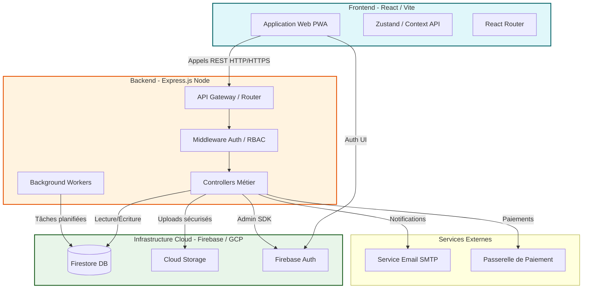

# Architecture Globale d'Olmart

Ce document décrit l'architecture système globale de la plateforme de commerce électronique Olmart, conçue pour opérer avec une résilience absolue au sein d'environnements contraints (iframe de prévisualisation AI Studio) et sur les infrastructures réseau algériennes (3G/4G).

---

## 🚀 1. INFRASTRUCTURE & ROUTAGE DE BOUT EN BOUT

### 1.1 Diagramme d'Architecture Système (Rendu ASCII)

```
┌────────────────────────────────────────────────────────────────────────┐
│                          NAVIGATEUR DU CLIENT                          │
│                                                                        │
│   ┌────────────────────────────────────────────────────────────────┐   │
│   │               IFRAME SANDBOX (AI Studio Preview)               │   │
│   │                                                                │   │
│   │   [ Interface React 18 / Tailwind ]                            │   │
│   │   │                                                            │   │
│   │   │ 1. Demande OTP / Verrouillage Session                      │   │
│   │   ▼                                                            │   │
│   │   [ Firebase Web Client SDK ] <───► [ Firebase Auth Server ]   │   │
│   │   │                                                            │   │
│   │   │ 2. Émission d'un IDToken JWT                               │   │
│   │   ▼                                                            │   │
│   │   [ Intercepteur HTTP Axios ]                                  │   │
│   │     Injecte 'Authorization: Bearer <JWT>'                      │   │
│   └─────┬──────────────────────────────────────────────────────────┘   │
└─────────┼──────────────────────────────────────────────────────────────┘
          │
          │ 3. Appels d'API REST Chiffrés (HTTPS)
          ▼
┌────────────────────────────────────────────────────────────────────────┐
│                    PASSERELLE D'ACCÈS & BACKEND                        │
│                                                                        │
│   [ Ingress Nginx Reverse Proxy ]                                      │
│   │                                                                    │
│   │ 4. Routage Interne (Port 3000 / Host: 0.0.0.0)                     │
│   ▼                                                                    │
│   [ Serveur Express.js Node/TS ]                                       │
│   ├── Middleware de Validation (Schema Check, Wilayas 01-58)           │
│   ├── Auth Security Middleware (Vérification JWT explicite)           │
│   └── Contrôleurs Métier (Transactions ACID, Escrow, Commissions)      │
└─────────┬───────────────────────────────┬──────────────────────────────┘
          │                               │
          │ 5. SDK d'Administration       │ 6. Appels IA Chiffrés
          ▼                               ▼
┌──────────────────────────────┐ ┌──────────────────────────────┐
│  FIREBASE INFRASTRUCTURE     │ │      GEMINI CORE API         │
│                              │ │                              │
│   [ Firebase Admin SDK ]     │ │   [ @google/genai SDK ]      │
│   ├── Auth Custom Claims     │ │   └── Gemini-3.5-flash       │
│   ├── Firestore ACID         │ │       (Modération invisible  │
│   └── Cloud Storage Secure   │ │        et arbitrage)         │
└──────────────────────────────┘ └──────────────────────────────┘
```

### 1.2 Isolation des Frontières de SDK (Anti-Crash Build)
Pour interdire toute erreur de compilation ou de fuite de clés privées, le système observe un cloisonnement étanche des bibliothèques de services Google :
*   **SDK Client (`firebase/app`, `firebase/auth`) :** Importé exclusivement dans la couche de présentation React (`/src/`). Sa seule responsabilité est l'authentification OTP initiale et le maintien de la session dans la sandbox.
*   **SDK Admin (`firebase-admin`) :** Chargé uniquement côté serveur Node.js (`server.ts`, `/src/routes/*`). Il dispose des privilèges élevés pour réaliser les transactions de stock critiques et manipuler de façon sécurisée les profils marchands.

---

---

## 📌 2. DIAGRAMME DE FLUX PHYSIQUES



---

## 🔒 3. INVARIANTS D'ARCHITECTURE ET MÉCANISMES DE SÉCURITÉ

Pour assurer une immunité totale contre le piratage d'API et garantir l'équité des transactions, Olmart applique 4 invariants absolus :

### 3.1 IDOR Guard (Contrôle d'Accès Strict)
Tout endpoint manipulant une ressource privée (Commande, Boutique, Profil) vérifie l'identité du propriétaire :
$$\text{req.user.uid} === \text{resource.ownerId}$$
En cas de non-coïncidence, l'appel réseau est avorté avec un code `HTTP 403 Forbidden` et consigné dans les logs d'infractions de sécurité.

### 3.2 ACID Transaction Locks (Zéro Survente)
Toute décrémentation de stock ou transaction financière s'effectue au sein d'un bloc transactionnel Firestore d'écriture unifiée :
```ts
db.runTransaction(async (transaction) => { ... })
```
Ce mécanisme garantit qu'aucun produit en quantité limitée (ex: ventes flash d'Olmart) ne puisse être vendu en double en cas d'appels réseau simultanés.

### 3.3 Silent AI Arbitrage (Confidentialité de l'IA)
L'intelligence artificielle d'arbitrage (modèle Gemini-3.5-flash) produit des analyses d'aide à la décision confidentielles. Les résultats de ces synthèses sont stockés de manière isolée dans Firestore et ne sont jamais visibles sur les comptes des acheteurs ou des vendeurs, prévenant ainsi toute manipulation sociale.

### 3.4 Rate Limiting & SMS Flood Protection
Pour contrer les attaques par déni de service et les coûts de passerelle SMS, l'émission d'OTP est régulée à 3 requêtes par heure par adresse IP et numéro de mobile. Un algorithme de batching par lots asynchrones gère également l'envoi de lettres d'information pour éviter les blocages de réputation SMTP.

---

## ⚙️ 4. SÉQUENCE DE BOOT ET STANDARD DE LOGGING D'ENTREPRISE

Lors du démarrage nominal du conteneur sur l'infrastructure d'exécution, la console du serveur Express émet des messages structurés facilitant le diagnostic automatique et l'observabilité.

### 4.1 Chronologie du Boot du Serveur
Lors du démarrage, l'ordonnancement d'initialisation suit cette séquence immuable :
1.  **Liaison HTTP :** Le serveur Express démarre l'écoute sur le port `3000` et s'associe à l'adresse réseau `0.0.0.0`.
2.  **Connexion SDK Admin :** Initialisation sécurisée du SDK d'Administration Firebase pour le projet cible.
3.  **Appairage de Base :** Cartographie et vérification de la disponibilité de la base Firestore d'Olmart.
4.  **Activation des Workers :** Démarrage de la file d'arrière-plan de traitement des fins d'événements et des expirations de Ventes Flash.

### 4.2 Standard de Visualisation des Logs (Traces Consoles)
Un démarrage nominal parfait se matérialise par les traces de console standardisées d'Olmart :

```text
🟢 [Olmart Gateway] 🚀 Booting HTTP Server on Port 3000...
🟢 [Firebase Admin] 🔐 Admin SDK Initialized for Project: olmart-prod-77a
🟢 [Firestore Core] 🟢 Connected and mapped Named Database: olmart-db-core
⚙️ [Olmart Workers] ⚡ Product Publisher Worker active (Ventes Flash check interval: 60s).
```

*Toute anomalie lors de cette séquence interrompt le boot et lève une erreur explicite avec le préfixe unifié `❌ [Nom du Module] ❌`.*
