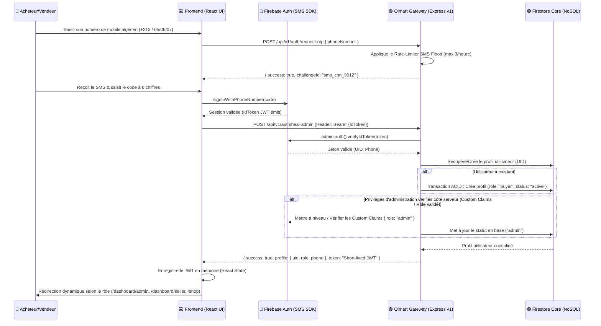

# Flux d'Authentification & RBAC (Anti-Desync Iframe)

Ce document détaille le processus d'enrôlement et d'accès sécurisé par OTP SMS (One-Time Password) et le mécanisme de réconciliation/maintien de session (Heal-Session) conçu pour contourner les restrictions d'iframe tierces.

---

## 🔐 1. DIAGRAMME DE SÉQUENCE DE L'AUTHENTIFICATION PAR OTP SMS

---

## 🔒 2. INTERCEPTEUR DE RÉCONCILIATION RÉSEAU (ANTI-DESYNC COOKIES)

Puisque Olmart s'exécute dans une iframe AI Studio, l'usage des cookies de session traditionnels est désactivé. L'authentification est maintenue grâce à l'injection dynamique :

1.  **En-tête d'autorisation :** Le client React intercepte chaque requête sortante de l'API Axios/Fetch pour injecter l'en-tête `Authorization: Bearer <JWT>`.
2.  **Restauration (Heal-Session) :** En cas d'erreur `HTTP 401 Unauthorized` reçue de la gateway, le client sollicite en tâche de fond le service `heal-session` pour régénérer un jeton via le SDK Firebase Web local en transmettant le refresh token natif de Firebase, résolvant de manière transparente la déconnexion intempestive.

---

## 🛡️ 3. RÔLES ET PRIVILÈGES DU SYSTÈME (RBAC MATRICE)

| Rôle | Portée d'accès | Droits d'écriture critiques |
| :--- | :--- | :--- |
| **Acheteur (`buyer`)** | Catalogue public, commandes personnelles, profil, litiges personnels | Création de commande, ouverture de litige, annulation |
| **Vendeur (`vendor`)** | Boutique propre, gestion des produits, commandes reçues, retrait balance | Ajout/édition de produit (fichiers KYC), validation expédition |
| **Administrateur (`admin`)**| Console d'administration globale, arbitrage des litiges, modération marchands, configuration des commissions | Approbation/rejet de boutique (KYC), résolution souveraine de litige, configuration globale des commissions |

