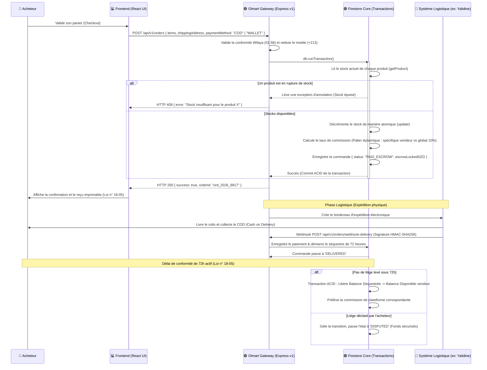

# Flux d'une Commande (Transactions ACID & Séquestre Escrow)

Ce document détaille la cinématique technique complète du cycle de vie d'une commande sur Olmart, de la vérification concurrentielle des stocks physiques jusqu'au dénouement financier sous séquestre réglementaire.

---

## 📦 1. CINÉMATIQUE COMPLÈTE DE LA TRANSACTION



---

## 🔒 2. SÉCURITÉ & ROBUSTESSE DU CYCLE TRANSITIONNEL

### 2.1 Verrou ACID de Stock (Zéro Survente)
La décrémentation est encadrée dans un bloc transactionnel Firestore `runTransaction` interdisant les lectures sales. Si deux acheteurs achètent simultanément le dernier exemplaire d'un produit, Firestore invalide automatiquement la deuxième écriture conflictuelle et force une tentative de réévaluation du stock avant de retourner une erreur d'indisponibilité.

### 2.2 Détermination Dynamique de la Commission (Double Palier)
Lors de l'enregistrement de la commande, le moteur de calcul interroge le document `/users/{vendeur_uid}` :
$$\text{Commission} = \text{totalPrice} \times \begin{cases} 
\text{commissionRateOverride} & \text{si renseigné} \\
10\% & \text{sinon (taux global)}
\end{cases}$$

### 2.3 Réconciliation par Webhook Signé
Les retours logistiques et encaissements physiques (COD) proviennent de l'API du transporteur par webhook. Pour se prémunir des falsifications de solde, la passerelle Olmart exige une signature cryptographique `HMAC-SHA256` générée avec la clé secrète du transporteur et transmise dans l'en-tête `X-Olmart-Signature`.

---

## 📝 3. MATRICE DE TRANSITION DES ÉTATS DE COMMANDE

```text
[PENDING_PAYMENT] ──(Paiement validé)──► [PAID_ESCROW] ──(Vendeur emballe)──► [PREPARING]
                                                                                │
[COMPLETED] ◄──(72h écoulées sans litige)── [DELIVERED] ◄──(Colis remis)─── [SHIPPED]
    │                                            │
    ▼                                            ▼
[REVENUE_RELEASED]                         [DISPUTED] (Fonds gelés pour enquête)
```

