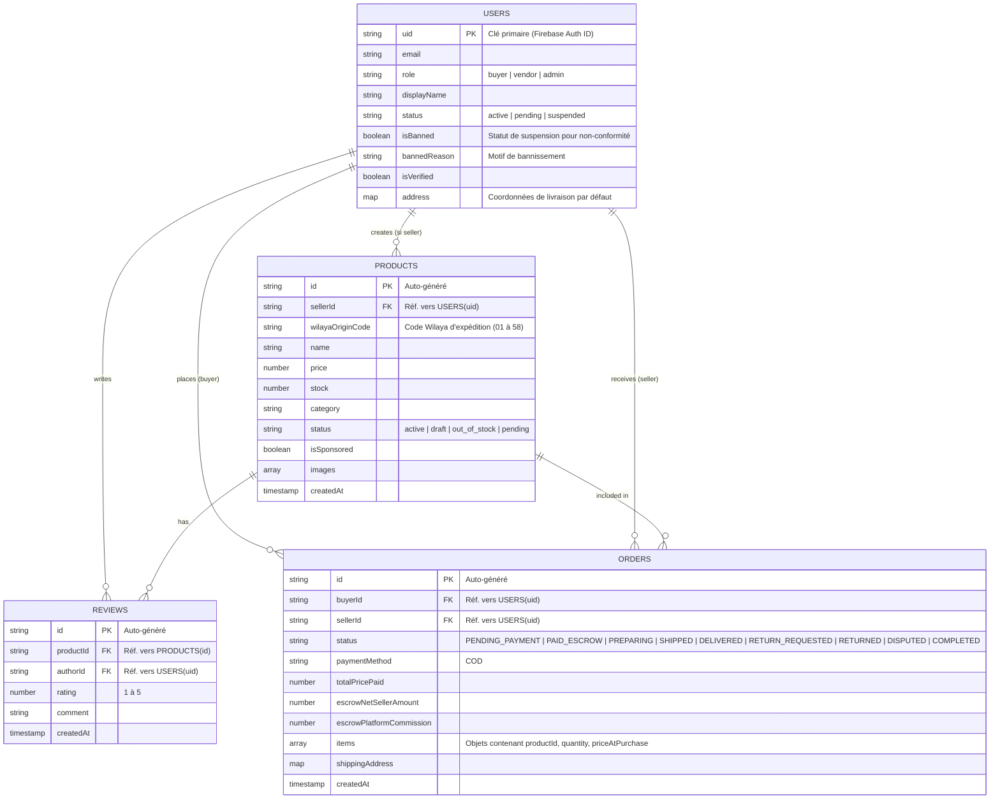

# Schéma de Base de Données (Firestore NoSQL)

Ce document présente la modélisation des données d'Olmart. Dans un environnement NoSQL orienté documents comme Firebase Firestore, les relations ne se font pas via des JOINs SQL stricts, mais plutôt via des références de clés étrangères (UID/ID) ou des sous-collections selon la volumétrie.

## Diagramme d'Entité-Relation (ERD Conceptuel)

Bien que Firestore soit NoSQL, ce diagramme ER permet de visualiser les liens conceptuels entre les principales collections racine.

## Stratégie de Modélisation NoSQL (Olmart)

1. **Collections Racine Favorites (Root Collections) :**
   - `users`, `products`, `orders`, `reviews`.
   - L'utilisation de collections racine avec des clés étrangères (`sellerId`, `buyerId`) est privilégiée par rapport aux sous-collections volumineuses, car cela permet une requête globale via des **Index Composites** (ex: récupérer tous les produits de la plateforme filtrés par catégorie, indépendamment du vendeur).

2. **Dénormalisation vs Référence :**
   - **Historique immuable (Commandes) :** Lorsqu'une commande est passée, les détails essentiels du produit (nom, prix au moment de l'achat) sont *dénormalisés* (copiés) dans le document de la commande (array `items`). Si le vendeur modifie le prix de son produit le lendemain, la facture de la commande précédente reste intacte.
   - **Synchronisation :** Les profils utilisateurs maintiennent leur statut de rôle (`buyer`, `seller`, `admin`), vérifié conjointement avec les Custom Claims de Firebase Auth pour une sécurité maximale.

3. **Transactions ACID :**
   - La mutation des stocks dans la collection `products` et la création du document dans `orders` sont toujours encapsulées dans une transaction Firestore (`db.runTransaction()`) pour éviter les états de course (race conditions) et la sur-vente.
