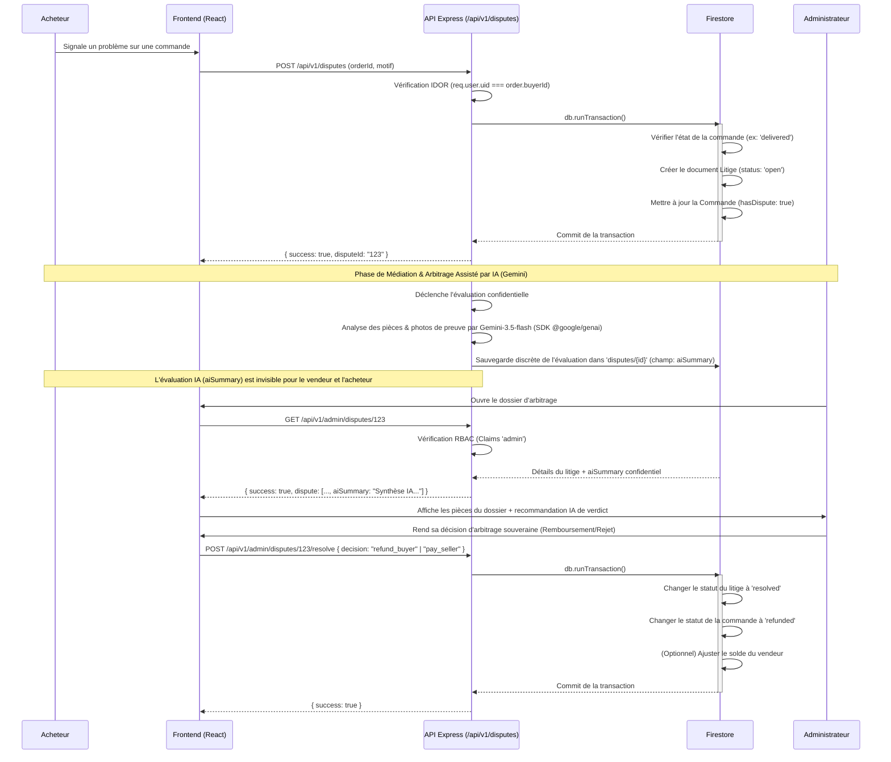

# Flux du Système de Résolution de Litiges

Ce diagramme illustre le processus de gestion des litiges entre acheteurs et vendeurs, avec l'intervention de l'administrateur en tant qu'arbitre.

## Note sur l'Architecture Financière (Virements & Reversements)

**Optimisation & Flux de Clôture :**
Le diagramme modélise l'ajustement du statut de la commande lors de la résolution du litige. Pour les reversements marchands et les indemnisations éventuelles, la comptabilisation s'effectue directement sur le grand-livre de facturation de la commande sans dépendance à un solde électronique intermédiaire.

**Évolution recommandée :**
Les événements financiers de clôture de litige émettent des notifications administratives permettant le traitement des flux de régularisation bancaire/CCP en toute conformité.
